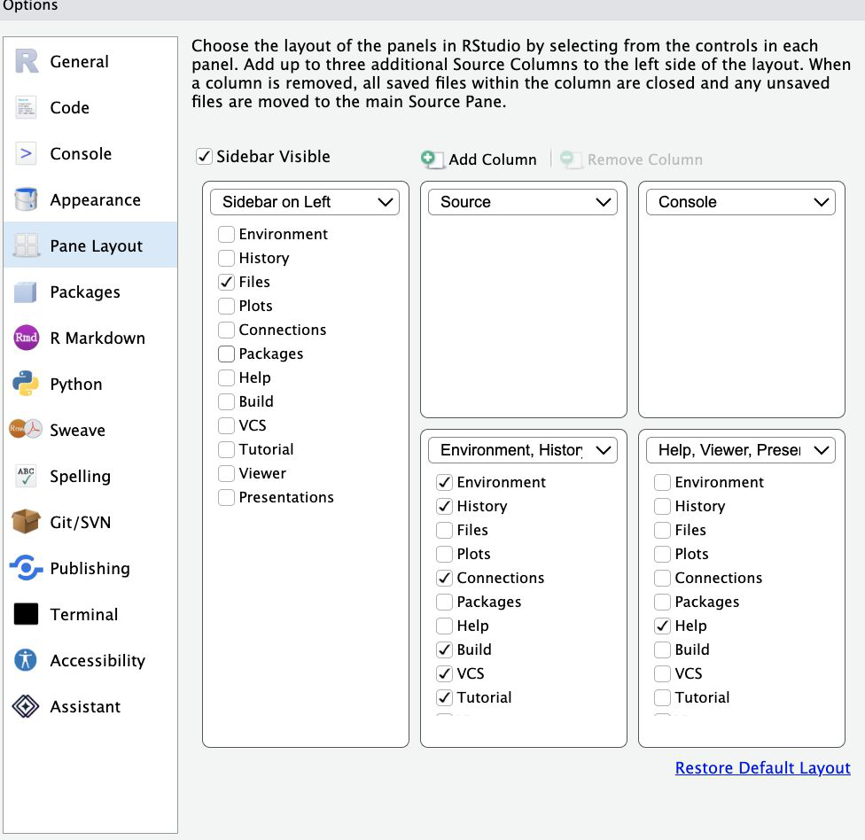

## Structure of our workshop

- Each module is about 25 minutes long
- There is an exercise at the end of each module
- We aim to cover slides for each module in 17-ish minutes
- About 8-ish minutes to go through exercises
- We'll have a 15-minute break at the end of module 3
- The github repo is (and will remain) available:
  <https://github.com/khanna-lab/ssc-ergm-hepcep>
- The POSIT cloud space (next slide) is active until about September 20

## POSIT workspace: *[link shared with participants]*

- Open the above link
- Sign in to Posit Cloud (or sign up if it's your first time).
- Click the project to launch it; RStudio loads (first launch takes a moment).
- Arrange the panes however you like (Tools -> Global Options, example on next slide)
- In the console, run `renv::restore()` to sync the library.
- It should report "already synchronized with the lockfile." (If prompted about
  pandoc, answer `Y`)

##

{width="62%" fig-align="center" fig-alt="RStudio Global Options dialog showing the Pane Layout panel, with Sidebar on Left, Source, Console, and the Environment/History and Help/Viewer/Presentation panes"}
