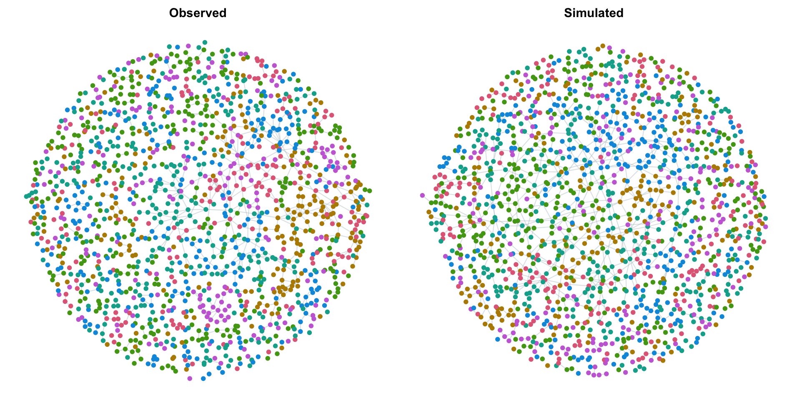

```{r setup}
#| include: false
#| eval: true
library(statnet)
library(here)
pre <- readRDS(here::here("modules", "precomputed", "intro.rds"))
```

## Introducing the workshop
- A slide of two explaining the outline and structure of the workshop
- To Be Done

## Why this intro

- Core ideas in 30 minutes, on a familiar example: **teen friendships**
- Builds to the workshop's key concepts end to end.
- **No ERGM experience needed**
- Running example adapted from: [Goodreau et al. (2008), "A statnet Tutorial," Journal of Statistical Software 24(9), under CC‑BY.]{.accent}

::: notes
Everything here runs on `faux.magnolia.high`, which ships with `statnet`, so no workshop
data is required. Module 1 then applies the same ideas to syringe-sharing networks.
Code chunks are shown for illustration; every result is precomputed by
`R/precompute-intro-fit.R` + `R/precompute-intro-gof.R`, so the deck renders without
re-fitting. This module reproduces the statnet-tutorial example (Goodreau et al. 2008,
JSS 24(9)); the article is CC‑BY, so adapting it here with attribution is fine.
:::

---

## Based on the statnet tutorial{.smaller}

::: {.smallish}
{width="70%" fig-align="center"}
:::

::: {.center}
[Reused under CC‑BY]{.smallish}
:::

::: notes
Showing the title page makes the provenance unmistakable: this module reproduces the
running example from this tutorial. CC‑BY permits reuse and adaptation with attribution.
:::

---

## The question


- How do adolescents form friendships?
- What processes that generate the network structures we see?

**Micro-level processes → macro-level structure**

::: notes
Sometimes we care about people's attributes; here the *pattern of ties* is the point.
We'll pin down three things: what a generative process is, what "structure" is, and how to
tell if a process reproduces the structure.
:::

---

## Where we're going

1. **Describe** the network: what does the structure look like?
2. **Summarize** it as numbers: these become our **targets**
3. **Model** it: null vs. assortative mixing
4. **Simulate**: does the model reproduce the targets?

::: notes
This arc (describe, summarize, model, check) is the workshop in miniature.
:::

---

## The data

```{r load}
#| eval: false
library(statnet)
data("faux.magnolia.high")
fmh <- faux.magnolia.high

c(students = network.size(fmh),
  ties     = network.edgecount(fmh))
```

```{r load-out}
#| echo: false
#| eval: true
pre$size
```

`faux.magnolia.high` — the 1,461-adolescent friendship network analyzed in the
statnet tutorial (Goodreau et al. 2008). Directionality ignored for illustration.

::: notes
1,461 students, 974 undirected friendship ties. A to B and B to A are the same tie here.
:::

---

## What does it look like?

{width="100%" fig-align="center"}

::: notes
Colored by grade: ties visibly cluster within grade, with a fringe of isolates. Each point
is a student; lines are friendships. The next two slides put numbers on both.
:::

---

## Who's in the network?

```{r attrs}
#| eval: false
table(fmh %v% "Grade")
table(fmh %v% "Sex")
```

```{r attrs-out}
#| echo: false
#| eval: true
pre$grade_tab
pre$sex_tab
```

::: notes
Each node carries attributes: Grade, Sex, Race. These are the ingredients for the
"social processes" we'll hypothesize.
:::

---

## Structure: who connects with whom?

```{r mixing}
#| eval: false
mixingmatrix(fmh, "Sex")
```

```{r mixing-out}
#| echo: false
#| eval: true
pre$sex_mix
```

Most ties sit on the diagonal: friendships cluster **within** sex.

::: notes
A mixing matrix counts ties by the sex of the two people. Heavy diagonal means assortative
mixing. Same story for grade and race.
:::

---

## Structure: how many friends?

```{r degree}
#| eval: false
summary(fmh ~ degree(0:5))
```

```{r degree-out}
#| echo: false
#| eval: true
pre$degree
```

- Most students have **few** ties
- A few students have many.
- The degree distribution is right-tailed.

::: notes
`degree(0:5)` counts nodes with exactly 0, 1, ... 5 ties. This shape (many low-degree,
few high-degree) is typical of social networks and will matter for model fit.
:::

---

## These summaries *are* network statistics

```{r targets}
#| eval: false
summary(fmh ~ edges +
          nodematch("Grade") +
          nodematch("Race") +
          nodematch("Sex"))
```

```{r targets-out}
#| echo: false
#| eval: true
pre$targets
```

Each number counts a feature of the observed network.

::: notes
`edges` is total ties; each `nodematch` is ties within that attribute. We just computed
four numbers that describe the structure. Hold onto them: they're about to become
*targets*.
:::

---

## What is a "network target"?

::: {.punch}
A target is a summary statistic we want the model to reproduce.
:::

- `summary(net ~ terms)` **computes** them from data
- `ergm(net ~ terms, target.stats = …)` **fits a model to those numbers**
- So we can model a network with **only aggregate summaries**, no full
  who-knows-whom matrix

::: notes
This is the crux of the workshop. Here we have the whole network, so the targets are the
observed counts. In Module 1, the targets come from meta-analysis summaries (mixing
matrices, degree distributions) and we never see one full observed network. ERGMs let us
fit to the summaries regardless.
:::

---

## What is an ERGM?

**Similar to logistic regression for ties.**

- **Outcome:** does a tie exist between two people? (0/1)
- **Predictors:** network statistics (the target terms)
- **Coefficients:** log-odds of a tie, converted to probabilities

::: notes
The left-hand side is the observed network; the right-hand side is the terms, which are
exactly the statistics we just computed. R and statnet run the estimation for us. Everything
that follows is this one idea.
:::

---

## Null model: ties form at random

```{r null}
#| eval: false
random.m <- ergm(fmh ~ edges)
plogis(coef(random.m))   # baseline tie probability
```

```{r null-out}
#| echo: false
#| eval: true
pre$null_prob
```

`edges` is the intercept: baseline density. Networks are overwhelmingly
**non**-ties.

::: notes
Log-odds about −6.99, probability ≈ 0.0009. A random pair almost never shares a tie.
:::

---

## Assortative mixing

```{r assort}
#| eval: false
assort.m <- ergm(fmh ~ edges +
                   nodematch("Grade") +
                   nodematch("Race") +
                   nodematch("Sex"))
round(coef(assort.m), 2)
```

```{r assort-out}
#| echo: false
#| eval: true
pre$assort_coef
```

::: notes
All terms here are dyad-independent, so this fits instantly via logistic regression, no
MCMC. Positive coefficients mean ties are more likely within that attribute.
:::

---

## Interpretation

- Baseline log-odds ≈ −10.0 → probability 4.5 × 10⁻⁵
- Same grade: −10.0 + 3.2 ≈ −6.8 → probability ≈ 0.001

::: {.punch}
A same-grade tie is ~22× more likely than a random pair.
:::

::: notes
The `edges` term is the intercept; each `nodematch` shifts the log-odds when two people
share that attribute. Log-likelihood also jumps (−7790 to −6528): a better fit.
:::

---

## Is a better-fitting model *good enough*?

- A higher log-likelihood says "better"
- But does the model *reproduce* the structure we care about?
- The test: simulate many networks, compare to the data

::: notes
A converged model is not necessarily a well-aligned one. We pick a structural property we
care about and check whether the data sits inside the simulated spread.
:::

---

## Goodness of fit: null model{.smaller}

```{r gof-null}
#| echo: false
#| eval: true
#| fig-width: 8.5
#| fig-height: 5.2
#| out-width: "92%"
#| fig-align: center
plot(pre$gof_null)
```

::: notes
Solid line = observed degree distribution; boxplots = 100 networks simulated from the
edges-only model. It misfits badly: too few isolates (degree 0), too many degree-1 nodes.
:::

---

## Goodness of fit: assortative model{.smaller}

```{r gof-assort}
#| echo: false
#| eval: true
#| fig-width: 8.5
#| fig-height: 5.2
#| out-width: "92%"
#| fig-align: center
plot(pre$gof_assort)
```

::: notes
Closer than the null model, but still off — the observed line drifts outside the simulated
spread at low degrees. Mixing terms alone don't capture the degree structure.
:::

---

<!-- ## Observed vs. simulated

{width="100%" fig-align="center"}

::: notes
The fitted model regenerates the within-grade clustering: same generative signature. Same
node set and attributes; only the edges are re-drawn. It captures grade homophily and
density, but (as the GOF showed) still misses higher-order structure like triadic closure.
:::

--- -->

## What's missing?

- Friends of friends tend to connect: **triadic closure**
- Captured with `gwesp(...)` → fit improves further
- Raw triangle counts can cause **degeneracy** (revisited in Module 4)

::: notes
GWESP, the geometrically-weighted edgewise shared partner term, down-weights each
additional shared friend, capturing the non-linear way closure works.
:::

---

## Fit the friend-of-a-friend model

Add **GWESP** — geometrically-weighted edgewise shared partners — to the assortative model:

```{r gwesp-code}
#| eval: false
gwesp.m <- ergm(fmh ~ edges +
                  nodematch("Grade") +
                  nodematch("Race") +
                  nodematch("Sex") +
                  gwesp(0.25, fixed = TRUE))
round(coef(gwesp.m), 2)
```

```{r gwesp-out}
#| echo: false
#| eval: true
pre$gwesp_coef
```

- GWESP down-weights each *additional* shared friend — closure without runaway triangles
- Dyad-dependent → fit by **MCMC**; precomputed so the deck renders fast

::: notes
The `ergm()` call is shown for teaching but not run live — the fit is precomputed by
`R/precompute-intro.R` into `modules/precomputed/intro.rds`. gwesp decay 0.25, fixed;
gwesp coefficient ≈ 1.75, log-likelihood ≈ −6100 (null −7790, assortative ≈ −6528).
:::

---

## Goodness of fit: friend-of-a-friend model {.smaller}

```{r gof-gwesp}
#| echo: false
#| eval: true
#| fig-width: 8.5
#| fig-height: 5.2
#| out-width: "92%"
#| fig-align: center
plot(pre$gof_gwesp)
```

::: {.punch}
Much better
:::

::: notes
Compare with the earlier assortative GOF: adding closure pulls the simulated degree
distribution onto the observed line. A clear, checkable improvement — though, as the later
modules stress, still not necessarily the whole story.
:::

---

## Network targets, revisited

::: {.punch}
Targets are the bridge from data to model.
:::

- Every summary in this module (mixing, degree) is a candidate **target**
- `target.stats` fits the model to those numbers
- Simulation checks whether the model reproduces them
- **Module 1:** targets come from aggregate data, no full network needed

::: notes
The one idea to carry out of this module. We computed targets from a full network here; the
workshop's real setting is fitting to summary targets alone.
:::

---

## Takeaway

<div class="flow">
  <div class="flow-box">Explore</div>
  <div class="flow-arrow">↓</div>
  <div class="flow-box">Summarize as targets</div>
  <div class="flow-arrow">↓</div>
  <div class="flow-box">Model</div>
  <div class="flow-arrow">↓</div>
  <div class="flow-box">Simulate to check</div>
</div>


::: notes
That shift, fitting to summary targets rather than one observed network, is exactly why
simulation-as-diagnostic (Module 5) replaces standard `gof()`.

Source for this module's running example (CC‑BY): Goodreau, S. M., Handcock, M. S.,
Hunter, D. R., Butts, C. T., & Morris, M. (2008). A statnet Tutorial. *Journal of
Statistical Software*, 24(9), 1–26. https://doi.org/10.18637/jss.v024.i09
Further reading: Robins et al. (2007).
:::
