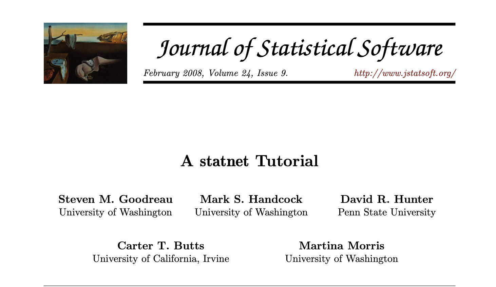
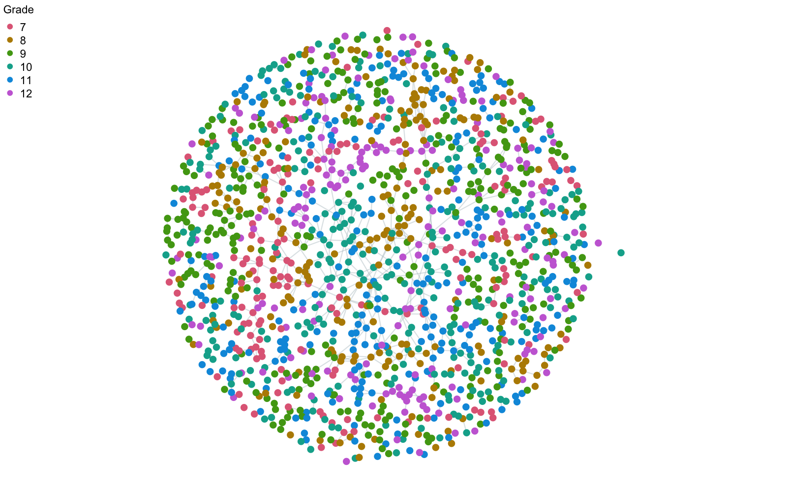
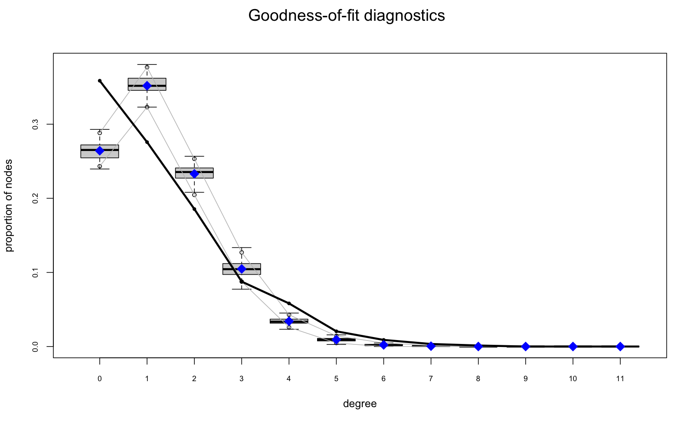
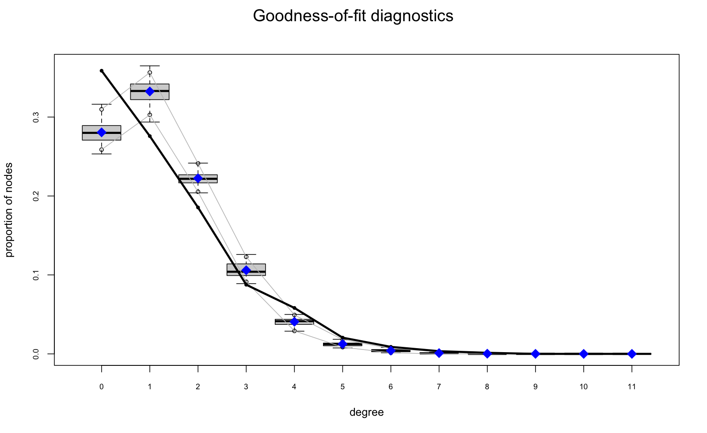
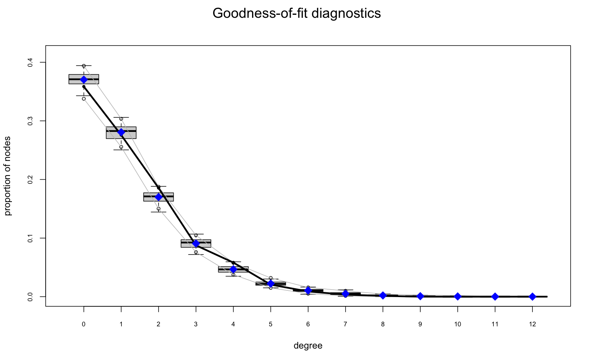

## Introducing the workshop
- A slide of two explaining the outline and structure of the workshop
- To Be Done

## Why this intro

- Core ideas in 30 minutes, on a familiar example: **teen friendships**
- Builds to the workshop's key concepts end to end.
- **No ERGM experience needed**


::: notes
Everything here runs on `faux.magnolia.high`, which ships with `statnet`, so no workshop
data is required. Future modules then apply the same ideas to syringe-sharing networks.
Code chunks are shown for illustration; every result is precomputed by
`R/precompute-intro-fit.R` + `R/precompute-intro-gof.R`, so the deck renders without
re-fitting. This module reproduces the statnet-tutorial example (Goodreau et al. 2008,
JSS 24(9)); the article is CC‑BY, so adapting it here with attribution is fine.
:::

---

## Based on the statnet tutorial{.smaller}

::: {.smallish}
{width="70%" fig-align="center"}
:::

::: {.center}
[Reused under CC‑BY]{.smallish}
:::

::: notes
Showing the title page makes the provenance unmistakable: this module reproduces the
running example from this tutorial. CC‑BY permits reuse and adaptation with attribution.
:::

---

## The question


- How do adolescents form friendships?
- What processes generate the network structures we see?

**Micro-level processes → macro-level structure**

::: notes
Sometimes we care about people's attributes; here the *pattern of ties* is the point.
We'll pin down three things: what a generative process is, what "structure" is, and how to
tell if a process reproduces the structure.
:::

---

## Where we're going

1. **Describe** the network: what does the structure look like?
2. **Summarize** it numerically: these become our **targets**
3. **Model** it: null vs. assortative mixing 
4. **Simulate**: does the model reproduce the underlying empirical structures?

::: notes
This arc (describe, summarize, model, check) is the workshop in miniature.
:::

---

## The data

- Network of 1,461 adolescent friendships (`faux.magnolia.high`)
- 974 friendship "ties" (other common terms: "links", or "edges")
- Directionality ignored for illustration

```{r load}
#| eval: false
library(statnet)
data("faux.magnolia.high")
fmh <- faux.magnolia.high

c(students = network.size(fmh),
  ties     = network.edgecount(fmh))
```




::: notes
1,461 students, 974 undirected friendship ties. A to B and B to A are the same tie here.
:::

---

## What does it look like?

:::{.smallish}
{width="100%" fig-align="center"}
:::

(Comments on structure are needed: what are we seeing?)

::: notes
Colored by grade: ties visibly cluster within grade, with a fringe of isolates. Each point
is a student; lines are friendships. The next two slides put numbers on both.
:::

---

## Some Distributional Characteristics of Persons in the Network

```{r attrs}
#| eval: false
table(fmh %v% "Grade")
table(fmh %v% "Sex")
```





::: notes
Each node carries attributes: Grade, Sex, Race. These are the ingredients for the
"social processes" we'll hypothesize.
:::

---

## Structure: who connects with whom?

```{r mixing}
#| eval: false
mixingmatrix(fmh, "Sex")
```



- Most ties are in the diagonal cells. 
- Indicates that friendships appear to cluster **within** sex (i.e., "homophily").

::: notes
A mixing matrix counts ties by the sex of the two people. Heavy diagonal means assortative
mixing. Same story for grade and race.
:::

---

## Structure: how many friends?

```{r degree}
#| eval: false
summary(fmh ~ degree(0:5))
```



- Most students have **few** ties
- A few students have many.
- The degree distribution is right-tailed.

::: notes
`degree(0:5)` counts nodes with exactly 0, 1, ... 5 ties. This shape (many low-degree,
few high-degree) is typical of social networks and will matter for model fit.
:::

---

## These summaries *are* network statistics

```{r targets}
#| eval: false
summary(fmh ~ edges +
          nodematch("Grade") +
          nodematch("Race") +
          nodematch("Sex"))
```



Each cell represents a feature of the observed network.

::: notes
`edges` is total ties; each `nodematch` is ties within that attribute. We just computed
four numbers that describe the structure. Hold onto them: they're about to become
*targets*.
:::

---

## What is a "network target"?

- A target is a summary statistic we want the model to reproduce.
- Which targets to use is a question similar to considering model selection in regression.
- Includes parameters that "sufficiently" explain the process we are trying to model.

Code:
- `summary(net ~ terms)` **computes** them from data
- `ergm(net ~ terms, target.stats = …)` **fits a model to those numbers**
- So we can model a network with **only aggregate summaries**, no full
  who-knows-whom matrix

::: notes
This is the crux of the workshop. Here we have the whole network, so the targets are the
observed counts. In future modules, the targets come from meta-analysis summaries (mixing
matrices, degree distributions) and we never see one full observed network. ERGMs let us
fit to the summaries regardless.
:::

---

## What is an ERGM?

**Similar to logistic regression for ties.**

- **Outcome:** does a tie exist between two people? (0/1)
- **Predictors:** network statistics (the target terms)
- **Coefficients:** log-odds of a tie, converted to probabilities

::: notes
The left-hand side is the observed network; the right-hand side is the terms, which are
exactly the statistics we just computed. R and statnet run the estimation for us. Everything
that follows is this one idea.
:::

---

## Null model: ties form at random

```{r null}
#| eval: false
random.m <- ergm(fmh ~ edges)
plogis(coef(random.m))   # baseline tie probability
```



Interpretation 

- The above coefficient is the probability any two persons are friends.
- Modeled using the `edges` ERGM term.
- Additional terms will adjust the probability that nodes are connected using the "attributes" 
- The `edges` term is therefore analogous to the intercept in regression modeling.  

::: notes
Log-odds about −6.99, probability ≈ 0.0009. A random pair almost never shares a tie.
:::

---

## Assortative mixing

```{r assort}
#| eval: false
assort.m <- ergm(fmh ~ edges +
                   nodematch("Grade") +
                   nodematch("Race") +
                   nodematch("Sex"))
round(coef(assort.m), 2)
```



::: notes
All terms here are dyad-independent, so this fits instantly via logistic regression, no
MCMC. Positive coefficients mean ties are more likely within that attribute.
:::

---

## Interpretation

- Baseline log-odds ≈ −10.0 → probability 4.5 × 10⁻⁵
- Same grade: −10.0 + 3.2 ≈ −6.8 → probability ≈ 0.001

::: {.punch}
A same-grade tie is ~22× more likely than a random pair.
:::

::: notes
The `edges` term is the intercept; each `nodematch` shifts the log-odds when two people
share that attribute. Log-likelihood also jumps (−7790 to −6528): a better fit.
:::

---

## Is a better-fitting model *good enough*?

- A higher log-likelihood says "better"
- But does the model *reproduce* the structure we care about?
- The test: simulate many networks, compare to the data

::: notes
A converged model is not necessarily a well-aligned one. We pick a structural property we
care about and check whether the data sits inside the simulated spread.
:::

---

## Goodness of fit: null model{.smaller}

{width="92%" fig-align="center"}

::: notes
Solid line = observed degree distribution; boxplots = 100 networks simulated from the
edges-only model. It misfits badly: too few isolates (degree 0), too many degree-1 nodes.
:::

---

## Goodness of fit: assortative model{.smaller}

{width="92%" fig-align="center"}

::: notes
Closer than the null model, but still off — the observed line drifts outside the simulated
spread at low degrees. Mixing terms alone don't capture the degree structure.
:::

---

## Goodness of Fit

Observation

- While the [alternative assortative mixing]{.accent} model fit better, neither adequately captured the network.

Why might that be? 

- Our alternative model might still be missing something

Likely Candidate:

- In social networks, individuals who have common friends, are more likely to be friends with each other. 
- Let us specify this property within our generative model.

---

## Fit the friend-of-a-friend model{.smaller}

[Mechanism of interest: Triad Closure]{.accent}

- Two people with a shared friend are likely to connect.

[Intuitive statistic to model this: Triangles]{.accent}

- Estimates the increased likelihood of a tie forming between two nodes with a shared friend (triadic closure).

[But this does not account for the non-linearity in triad formation:]{.accent}

- The probability of connecting two people increases as the number of their shared friends increases.
- But this scaling is not linear. 
- The probability of two people connecting is far greater if they know 2 vs. 4 people in common, than whether they know 100 vs. 102 people in common.
- Using triangles in social networks leads to “degenerate” models

---

## The GWESP model {.smaller}

**GWESP** (geometrically-weighted edgewise shared partners) model closure while
down-weighting each *additional* shared friend .

```{r gwesp-code}
#| eval: false
gwesp.m <- ergm(fmh ~ edges +
                  nodematch("Grade") +
                  nodematch("Race") +
                  nodematch("Sex") +
                  gwesp(0.25, fixed = TRUE))
round(coef(gwesp.m), 2)
```



- Dyad-dependent, so this one is fit by **MCMC** (unlike the models above)
- Precomputed, so the deck renders without re-fitting

::: notes
gwesp decay 0.25, fixed. The gwesp coefficient is strongly positive; log-likelihood
improves to ≈ −6100 (null −7790, assortative ≈ −6528). The fit is precomputed by
`R/precompute-intro-fit.R`; the coefficients shown are read from `intro.rds`.
:::

---

## Goodness of fit: friend-of-a-friend model {.smaller}

{width="92%" fig-align="center"}

::: {.accent}
Much better
:::

::: notes
Compare with the earlier assortative GOF: adding closure pulls the simulated degree
distribution onto the observed line. A clear, checkable improvement — though, as the later
modules stress, still not necessarily the whole story.
:::

---


## Network targets, revisited

::: {.accent}
Target statistics are the bridge from data to model.
:::

- Every summary statistic in this module (mixing, degree) is a candidate **target**
- `target.stats` specifies those statistics in a single vector
- GOF Testing checks whether the model reproduces them
- **Future modules:** targets come from aggregate data, no full network needed

::: notes
The one idea to carry out of this module. We computed targets from a full network here; the
workshop's real setting is fitting to summary targets alone.
:::

---

## Simulate 
Show further how these fitted models behave upon simulation. 


## Most Importantly

<!-- <div class="flow">
  <div class="flow-box">Explore</div>
  <div class="flow-arrow">↓</div>
  <div class="flow-box">Summarize as targets</div>
  <div class="flow-arrow">↓</div>
  <div class="flow-box">Model</div>
  <div class="flow-arrow">↓</div>
  <div class="flow-box">Simulate to check</div>
</div> -->

- Using numerical methods to compare model fits is useful. 

- But even a better fitting model is not always adequate. 

- Proposing alternate models that capture relevant theoretical mechanisms is important.

- In practice, this process is often iterative and allows us to refine our understanding at each step. 


::: notes
That shift, fitting to summary targets rather than one observed network, is exactly why
simulation-as-diagnostic (Module 5) replaces standard `gof()`.

Source for this module's running example (CC‑BY): Goodreau, S. M., Handcock, M. S.,
Hunter, D. R., Butts, C. T., & Morris, M. (2008). A statnet Tutorial. *Journal of
Statistical Software*, 24(9), 1–26. https://doi.org/10.18637/jss.v024.i09
Further reading: Robins et al. (2007).
:::
