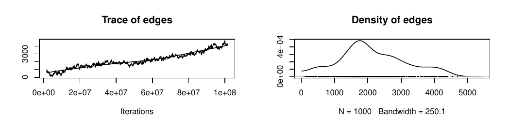
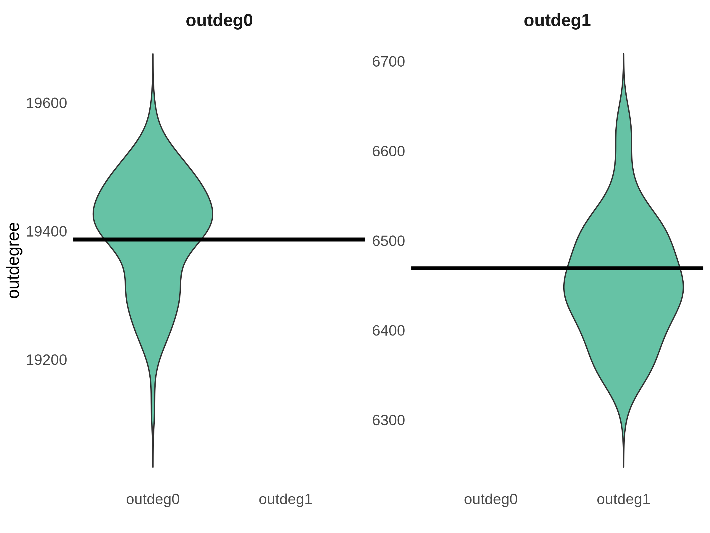

## What this module is

From **our** pipeline 
- Practical considerations on how fits failed 
- How we diagnosed failure
- Solutions that enabled recovery

- The general theory of how ERGMs are fit is well-studied. 

  * Handcock (2003)
  * Schweinberger (2011) 

- Building upon that theory, we derive **practical** recovery steps


::: notes
Set the posture up front: this is experience, not a degeneracy tutorial. Defer the
theory to the literature; the value-add is practical recognition and recovery.
:::

---

## Some Ways in which ERGMs don't Fit

Building further upon the converged Module 3, some specific terms further produced **non-convergent** models.

Usually, in one of three ways:

| What we saw | Symptom | 
|---|---|
| **Non-convergence** | Chains don't mix; `ergm` may error | 
| **Degeneracy** | Simulated nets nearly empty or near-complete; `ergm` may error | 
| **Poor alignment** | Converges, but simulated stats ≠ targets | 


## Non-Convergence: Indicator #1

In our **full pipeline** (n ≈ 32k, with a custom geographic term), adding
`odegree(0:2)` produced an error in estimation:

```
Error in ergm.MCMLE(...):
  Number of edges in a simulated network exceeds that in the observed by a
  factor of more than 20. This is a strong indicator of model degeneracy or
  a very poor starting parameter configuration.
```

- At this **simplified** n = 1,000 scale, `odegree(0:2)` fits fine.

- So to reproduce the same failure, we specify up to `odegree(0:3)`

::: notes
Degeneracy is data- and scale-dependent, not a fixed property of a term. Honest story:
the real degeneracy was odegree(0:2) at full scale; it doesn't reproduce at n=1000, so
we push to 0:3 for a live, reproducible demo.
:::


## Non-Convergence: Indicator #2 

`ergm` may report **"converged"** — that alone isn't reassurance.

- "Converged" means the algorithm *stopped*, not that it sampled well

- The **MCMC diagnostics** can still look poor

- So we check `mcmc.diagnostics(fit)` 

::: notes
Indicator #2: don't take "converged" at face value — the sampler may not have mixed.
mcmc.diagnostics is the check. Leads into "What we watched for."
:::

## Non-Convergence: Indicator #2 (Example) {.smaller}

A real MCMC diagnostic from our full pipeline  

 - The traces **drift upward** (instead of
settling around a stable mean) 
 - Concurrently, the edge density plots are not centered at 0, indicating divergence between the targets and fitted values.
 - Such plots can be produced for all specified terms in the ERGM


{width="90%" fig-align="center"}

::: notes
Real `mcmc.diagnostics()` output from net-ergm-v4plus (all PLOS ONE terms). The tell:
`edges` (and the mixing terms) trend up across iterations rather than hovering around a
stable level — poor mixing / not converged. Contrast with a well-mixed "fuzzy caterpillar."
:::

## Poor alignment: does it reproduce the targets? {.smaller}

A fit can converge cleanly — diagnostics fine — and still not reproduce the structure
you care about.

- A GOF summary can look **OK, or questionable** — either way, it's only a summary
- What we found practical: **simulate and look at the networks**, then compare the
  statistics that matter to their targets

```r
plot(simulate(fit_final, nsim = 1))   # does the simulated network actually look right?
```

::: {.accent}
Comparing a set of simulated networks — not the GOF summary — shows whether the
structure we care about is reproduced.
:::

::: notes
The third failure mode from the table: a converged, well-mixed fit that still misses its
targets. Simulate and compare — sometimes it exposes a gap, sometimes (as in our example)
it reassures. Bridge to Module 5.
:::

## Poor alignment (Example) — simulation holds {.smaller}

Simulate many networks and compare the structure we care about to its **target**
(black line):

{width="60%" fig-align="center"}

- The out-degree **targets fall within the simulated spread** — the model reproduces
  these counts (the violins straddle each target)
- The questionable-looking GOF didn't mean a broken model

::: {.accent}
Look at the simulated networks — they often hold the story the GOF summary muddies.
:::

::: notes
Real output from net-ergm-v4plus (simulate-from-ergms). Each violin is a statistic's
distribution across many simulated networks; the line is the target. The out-degree
targets sit inside the spread (modes just above), so the structure holds. The systematic
version of eyeballing a simulated network — bridge to Module 5.
:::


## Solution to each indicator


## Recap

Three failure modes we experienced, and how we told them apart:

- **Non-convergence** — algorithm can't settle → tune it (Module 3)
- **Degeneracy** — the spec is broken → reparameterize
- **Poor alignment** — converged but wrong → revisit spec or targets

::: {.punch}
Diagnostics check the algorithm; simulation checks the model.
:::

::: notes
The transferable skill is the triage, not any single fix — that judgment is what we're
sharing. For the theory of degeneracy: Handcock (2003), CSSS Working Paper 39;
Schweinberger (2011), JASA 106(496), 1361–1370.
:::

---

## Handoff to Module 5

This GOF was one check, done by hand.

::: {.punch}
Module 5: simulation as the *systematic* diagnostic (and the bridge to the ABM).
:::

::: notes
Frame Module 5 as scaling up today's GOF check into the workflow.
:::

---

## Exercise

Work in the Posit Cloud environment:

1. Fit `+ odegree(0:3)` on the mixing block — does it error, or return a degenerate fit?
2. If it returns, compare simulated edges to `edges_target`
3. Run `mcmc.diagnostics(fit_final)` — read the traces
4. Run `gof(fit_final, GOF = ~ idegree + odegree - model)` — do the distributions match?

::: notes
Steps mirror the run sheet; cap time on any live fit that hangs.
:::
