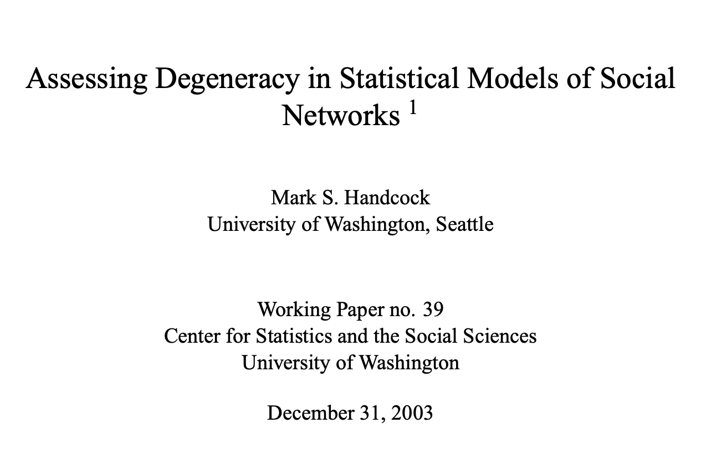

## This Module's Goal {.smallish}

::: {.accent}
From achieving convergence (Module 3) to diagnosing fit quality (this module):
:::

- Produced a staged set of convergent ERGMs. 
- But are the fitted models good enough?
- How do we diagnose the [quality]{.accent} of model fit?

::: {.accent}
In this module, we will discuss:
:::

- Practical considerations on the types of model failure.
- How we diagnose those failures.
- Some solutions to specific failure types.

::: notes
Where sequential fitting fits (JO's question): it's not a diagnostic — it's the convergence
strategy from Module 3. Pipeline = fit → diagnose → fix. Sequential/warm-start is a fitting
strategy (and later a fix for non-convergence); this module is the diagnostic step. Degeneracy,
unlike non-convergence, isn't fixed by a fitting strategy — it needs respecification.
:::

---

## Our Fitting Sequence, Revisited {.smallish}


- Our "real pipeline" was similar to Module 3 (below)  

| Step | Terms added | Fitting Algorithm |
|:----:|-------------|----------|
| 1–4 | `edges + nodemix(sex/young/race.num) + nodematch("chicago")` | MCMC (defaults) |
| 5 | `+ odegree(0)` | Stochastic Approximation (real pipeline) |
| 6 | `+ odegree(0:1)` | As above |
| 7 | `+ idegree(0:1) + odegree(0:1)` | Stochastic-Approximation + Hotelling |

- But, at the scale of our research problem, we needed to introduce Stochastic Approximation earlier. 

---

## Some Ways in which ERGMs do not Fit {.smallish}

| What we saw | Symptom | 
|---|---|
| **Degeneracy** | Simulated networks nearly empty or near-complete; `ergm` may error | 
| **Non-convergence** | Chains don't mix; `ergm` may error | 
| **Poor alignment** | Converges, but simulated stats ≠ targets | 

## Indicator #1 {.smallish}

:::: {.columns}

::: {.column width="62%"}

- In our **real pipeline** with standard tuning parameters, adding `odegree(0:2)` produced an error:

```
Error in ergm.MCMLE(...):
  Number of edges in a simulated network exceeds that in the
  observed by a factor of more than 20. This is a strong
  indicator of model degeneracy or a very poor starting
  parameter configuration.
```

- **Degeneracy:** the fitted model puts almost all its probability on a few **extreme graphs** (near-empty or near-complete).^[Handcock (2003), *Assessing Degeneracy in Statistical Models of Social Networks*, CSSS Working Paper 39. <https://csss.uw.edu/files/working-papers/2003/wp39.pdf>. Schweinberger (2011), *JASA* 106(496), 1361–1370.]
- Sometimes we see an error; other times the fitting process claims convergence, but the simulated networks are extreme.

:::

::: {.column width="38%"}

{fig-align="center" .caption-center style="border: 4px solid #2563eb; border-radius: 6px; padding: 6px;" fig-alt="Title page of Handcock 2003, Assessing Degeneracy in Statistical Models of Social Networks, CSSS Working Paper no. 39, University of Washington, December 31 2003"}

:::

::::

---

## Indicator #1: Degeneracy Causes and Solutions {.smallish}

Cause: 

    1. Can be scale-dependent: 
    - E.g.,  `odegree(0:2)` fits  at n = 1,000 but not in the full research model.  
    
    2. Can be caused by parameters in the model
    - E.g., Using `triangle` can create extreme positive feedback since a tie makes further ties more likely.

::: {.accent}
Degeneracy is a **model specification** problem.
:::

 - Usually cannot be fixed by control settings or warm-starting.
 - Alternate parameteric specifications or scale investigations can help. 


::: notes
Degeneracy vs. non-convergence (JO's question): both can throw this same error and both look like
"it won't fit," but they differ — degeneracy is a *model* property (mass on extreme graphs), while
non-convergence is the *algorithm* failing to settle. Sequential/warm-start helped the
hard-to-converge step (non-convergence), NOT degeneracy. The error message doesn't distinguish them —
there's no confirmatory test; the honest guide is that the *fixes* differ.
:::

---

## Indicator #2 {.smallish}

- A **non-convergence** failure (even when `ergm` may report **"converged"**). 

- "Converged" means the algorithm *stopped*, not that the model sampled well.

- In such cases, the `mcmc.diagnostics(fitted_ergm_obj)` may still look poor.

- Example on next slide.


::: notes
- Indicator #2: don't take "converged" at face value.
- mcmc.diagnostics is the check. Leads into the example.
:::

---

## Indicator #2 (Example) {.smallish}

A real MCMC diagnostic from our full pipeline  

 - The traces **drift upward/downward** (instead of
settling around a stable mean) 

 - These plots show each statistic **relative to its target**, so the target is the **0 line**.
  
- Ideally, the density mass sits around 0 (not the case here). 

{width="90%" fig-align="center"}

::: {.accent}
In this case: 
:::

- The model itself might be correctly specified.   
- But, the control parameters might not be. 
- The solution is often to  **tune the controls** (Module 3).


## Indicator #3 {.smallish}

 - A fit converges cleanly (no degeneracy errors, MCMC diagnostics OK.) 

- We still want to check if simulating from the fitted ERGM produces networks that match the targets.  

- We **simulate many networks** (e.g., `sims <- simulate(fitted_ergm_obj, nsim=100)`).

- Compare distributions on all specified statistics relative to their **targets**.

{width="55%" fig-align="center"}

- This shows good alignment between the outdegree distribution on the simulated networks relative to the target (black line).

## Indicator #3 (continued) {.smallish}

- But, there are three ways this can go: 
  1. The MCMC diagnostics and simulated statistics look good.
  2. The MCMC diagnostics look borderline, but the simulated structures look good relative to the targets. 
  3. The MCMC diagnostics look borderline, but the simulated network structures do not contain the target. 

::: {.accent}
Considerations:
:::

1. Great! We are (almost) done!
2. We often care about the simulated network alignment with the targets. If upon repeating the simulation with different seeds, the simulated networks usually contain the targets, we are (arguably) done, from the networks-for-ABM perspective.
3. In such a case, we can try further tuning the ERGM controls (Module 3). But, in a practical sense, we might also want to revisit our data sources, our computation of targets, and whether there are potential data quality/alignment issues.     


## Matching potential fixes to the failure modes 

The fix depends on which failure we have:

::: {.smaller}
| Failure | What it means | Fix |
|---|---|---|
| **Degeneracy** | ERGM errors out, or simulated networks are (nearly) full or empty  | Reparameterize the model (e.g., GWESP instead of triangles, as in Module 1) |
| **Non-convergence** | The MCMC diagnostics are poor | Tune the control parameters |
| **Poor alignment** | The fit converged | Revisit the specification, the target computation, or the data sampling/quality|
:::

::: {.accent}
- Non-convergence (usually) indicates a *controls* problem.
- Degeneracy and poor alignment are either *model* or data quality/processing problems.
:::


::: notes
The transferable skill is the triage, not any single fix — that judgment is what we're
sharing. For the theory of degeneracy: Handcock (2003), CSSS Working Paper 39;
Schweinberger (2011), JASA 106(496), 1361–1370.
:::

---

## Handoff to Module 5

We diagnosed these fits **by hand** -- reading MCMC diagnostics and simulating a network to compare alignment.

::: {.punch}
Module 5: simulation as the *systematic* diagnostic (and the bridge to the ABM).
:::

::: notes
Frame Module 5 as scaling up today's by-hand checks — especially the simulate-and-compare
move from Indicator #3 — into the workflow.
:::

---

<!-- 
## Exercise

Work in the Posit Cloud environment:

1. Fit `+ odegree(0:3)` on the mixing block — does it error, or return a degenerate fit?
2. If it returns, compare simulated edges to `edges_target`
3. Run `mcmc.diagnostics(fit_final)` — read the traces
4. Run `gof(fit_final, GOF = ~ idegree + odegree - model)` — do the distributions match?

::: notes
Steps mirror the run sheet; cap time on any live fit that hangs.
::: 
-->
