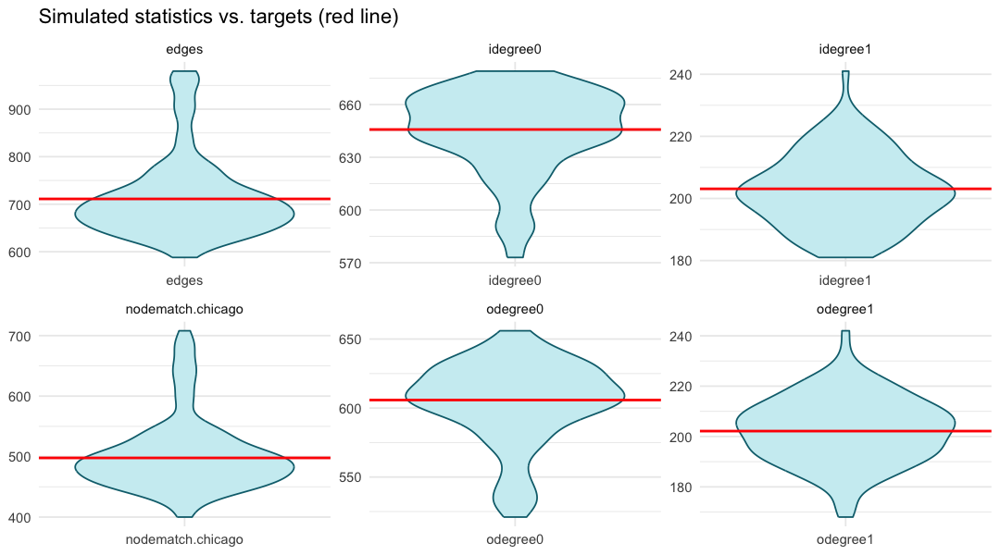

## This Module's Goal {.smallish}

::: {.accent}
Where Module 4 ended:
:::

- We diagnosed the model to ensure correctness:
  1. No degeneracy.
  2. Convergence diagnostics (MCMC diagnostics) are acceptable.
  3. Target statistics are contained within the distribution of the simulated networks.

::: {.accent}
In this module, we will:
:::

- Discuss a simple mechanism to formalize step #3 above for comparing alignment of target statistics with the simulated distribution of each statistic
- Build upon step #3 above to bridge to the ABM.

---

## Simulate an ensemble {.smallish}

```r
sims <- simulate(fit_final, nsim = 100)

sim_stats <- t(sapply(sims, \(s)
  summary(s ~ edges + odegree(0:1) + idegree(0:1) + nodematch("chicago"))))
```

- One row of statistics per simulated network.
- Compare each column's spread to its **target**.

---

## Read it: statistics vs. targets {.smallish}

{width="80%" fig-align="center"}

- Each violin: one statistic across 100 simulated networks. Red line: the **target**.

::: notes
Plot from `R/05a-simulation.R` (`out/sim-vs-targets.png`). To render: run the script and
copy the PNG into `modules/img/`.
:::

---

## Good vs. poor alignment {.smallish}

For each statistic

- **Good:** The distribution contains the target. 

- **Numeric summary:** Computed the simulated mean and a  simulation interval (usually 95%)

::: {.accent}
Repeat this process for every target statistic to:
:::

- Identify if the target statistic for any parameter is off
- If not, great!
- If yes, it is often a **fitting** (Modules 3 and 4) problem.
- We run through checks described in modules 3 and 4.

---

## Sample Code for Violin Plot  {.smallish}

## Sample Code for Simulation Interval {.smallish}


## Next Step: Crosswalk to the ABM {.smallish}

::: {.punch}
An aligned simulated network **is** the ABM input.
:::

Export one simulated network as two tables:

```r
net_sim <- simulate(fit_final, nsim = 1)

attrs <- data.frame(id = network.vertex.names(net_sim),  # agents
                    sex = net_sim %v% "sex", young = net_sim %v% "young", ...)
el    <- as.edgelist(net_sim)                            # partnerships (from, to)
```

- **Agents** = vertex attributes; **partnerships** = the edgelist.
- Export one edgelist per simulated network to carry **network uncertainty** into the ABM.

---

## We have a well fitting network! What next?

- Describe how flexible ABM formats can "ingest" this type of network as an input
- Also mention canonical products that do this (e.g., EpiModel)
- But our group often connects this to Repast or other ABM platforms (in R)

## Handoff to Module 6

::: {.punch}
Module 6: **spatial modeling** — geography as a first-class term.
:::

- We used `nodematch("chicago")` as a stand-in; Module 6 replaces it with a custom
  distance-based term.

---

## Exercise

Work in the Posit Cloud environment:

1. Run `R/05a-simulation.R` — simulate 100 networks from `fit_final`.
2. Read the violin plot: which statistics straddle their target?
3. Check the numeric table — any target outside the 95% interval?
4. If one is off, name the term you'd revise (back to Module 3).
5. Run `R/05b-export-abm.R` — export a simulated net to `edgelist.csv` + `vertex_attributes.csv`.

::: notes
Cap time on the live simulation; the pre-baked plot carries the point if it runs long.
:::
