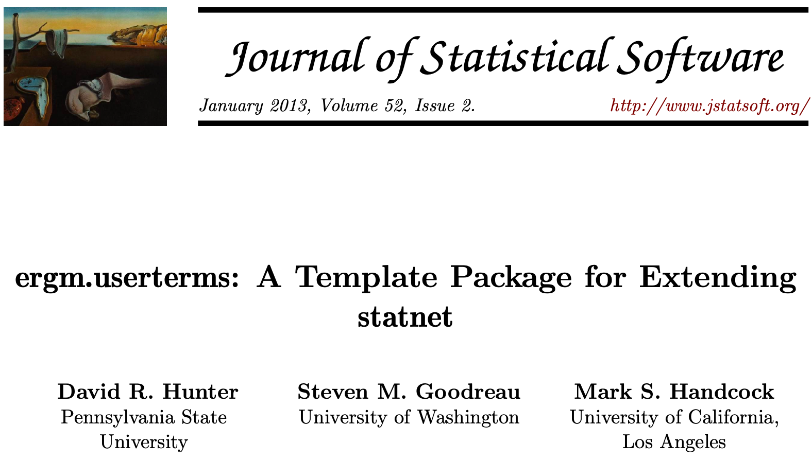
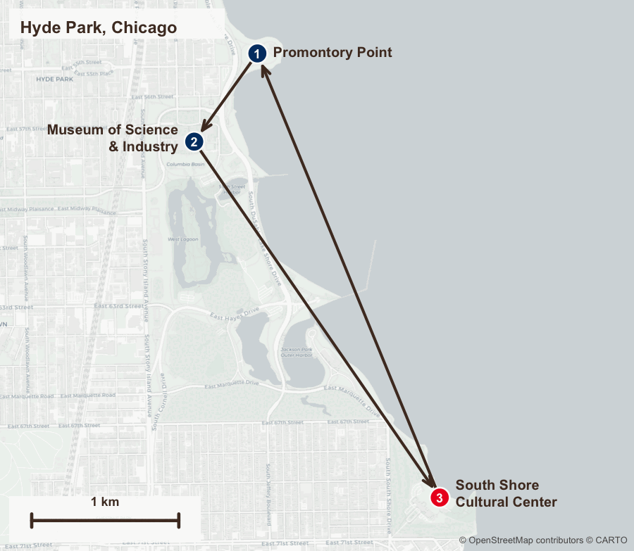

## This Module's Goal {.smallish}

::: {.accent}
Where Module 5 ended:
:::

- We simulated an ensemble and compared it to our targets.
- Geography entered the model as one crude term, `nodematch("chicago")`.

::: {.accent}
In this module:
:::

- Describe what that stand-in cannot say, and what our data would let us say instead.
- Meet `dnf`, a **custom ERGM term** we wrote for geocoded syringe-sharing ties.
- Learn the general recipe for writing your own term when `ergm` lacks one.

::: notes
This is the one module where we step outside the terms `ergm` ships with. The
transferable skill is the use of this extension mechanism. Frame it that way from the
first slide so people with different geography (or non-spatial covariates
entirely) stay engaged.
:::

---

## The `ergm.userterms` template {.smallish}

- The `statnet` team provides the ability for users of `ergm` capabilities to build custom terms, which we leverage extensively in this module.^[Hunter, Goodreau & Handcock (2013), ergm.userterms: A Template Package for Extending statnet. *Journal of Statistical Software* 52(2), 1–25. doi:10.18637/jss.v052.i02]

{width="70%" fig-align="center" fig-alt="Title page of the Journal of Statistical Software article 'ergm.userterms: A Template Package for Extending statnet' by Hunter, Goodreau and Handcock, January 2013, Volume 52, Issue 2"}


---

## The stand-in, and what it hides {.smallish}

::: {.gap}
Every model so far has carried geography as a single binary match:
:::

```r
net ~ ... + nodematch("chicago")     # 1 statistic: count of within-area ties
```

::: {.gap}
That statistic counts a tie between two Chicago residents **30km apart** exactly
the same as a tie between two residents **200m apart**.
:::

::: {.punch}
`nodematch` only reads whether two node labels match.
:::

::: {.gap}
The statistic is also symmetric, with no regard for which node is the source (tail) and which the target (head) of a tie.
:::


::: notes
The stand-in was a deliberate simplification so Modules 3-5 could run without a
compiled package. It answers a narrower question than we want, and answers it
correctly. Ask the room what a syringe-sharing partnership 30 km away implies
versus one across the street. Travel time alone makes those two ties different
objects.
:::

---

## What geography we actually have {.smallish}

We need two ingredients, and both are already in the workshop data.

::: {.gap}
**1. Per-node coordinates.** Every node carries a geocoded location:
:::

```r
head(nodes[, c("id", "zipcode", "lon", "lat", "chicago")])
#>   id zipcode       lon      lat chicago
#>    1   60107 -88.16948 42.02686       2
#>    2   60651 -87.72938 41.89706       1
```

::: {.gap}
**2. Empirical near/far proportions.** Our survey summaries report, for ties whose
source is inside or outside Chicago, what share go to a **near** partner and what
share go to a **far** one.
:::

| Source's area | Near | Far |
|---|:--:|:--:|
| **Chicago** (`chicago == 1`) | .457 | .229 |
| **Non-Chicago** (`chicago == 2`) | .163 | .151 |
: The four shares of the total tie count sum to 1. {tbl-colwidths="[50,25,25]"}

::: notes
`chicago` is derived in `R/generate-synthetic-data.R`, where zip codes beginning
"606" are 1 (city) and everything else is 2 (suburban/collar). 55% are category 1.
The lat/lon are zip-code centroids from the HepCEP synthetic population, so within
a zip code distance is zero. Flag that as a known coarseness if anyone asks.
:::

---

## What we want the model to say {.smallish}

Cross-classify every tie by **its source** and **how far it went**:

| Source's area | Near partner | Far partner |
|---|:--:|:--:|
| **Chicago** (`chicago == 1`) | `dnf.chicago.1.n` | `dnf.chicago.1.f` |
| **Non-Chicago** (`chicago == 2`) | `dnf.chicago.2.n` | `dnf.chicago.2.f` |
: {tbl-colwidths="[50,25,25]"}

- "Near" is defined by a **distance threshold**, one per area category.
- Four cells for two categories. More generally, **2n** cells for n categories.

::: {.accent}
No term in `ergm` does this so we wrote one.
:::

::: notes
The shape should feel familiar from Module 2's `nodemix`, a cross-classification of
edges into mutually exclusive cells.
:::

---

## The `dnf` term (distance near/far) {.smallish}

```r
library(ergm.userterms.hepcep)

summary(net ~ dnf(by = "chicago", thresholds = c(2, 2), base = 4))
```

| Argument | Meaning |
|---|---|
| `by` | Node attribute giving the category. Values of category must be `i = 1, 2, ..., n`. |
| `thresholds` | Near/far cutoff in **km**, one per category. This length sets n. |
| `base` | Which of the `2n` cells to **omit**. Defaults to the last one. |

- Coefficient names follow the fixed pattern `dnf.<by>.<i>.<n|f>`.
- `c(2, 2)` means 2 km for category 1 and 2 km for category 2. The thresholds are
  allowed to differ.

::: notes
The threshold vector doing double duty (setting both the cutoffs and the number of
categories) is a design quirk. There is no separate `levels` argument, so a
category with no threshold simply does not exist to the term.
:::

---

## Why one cell is dropped {.smallish}

Every edge is classified in **exactly one** of the `2n` cells, so the cells sum to the edge count:

::: {.gap}
```
dnf.chicago.1.n + dnf.chicago.1.f + dnf.chicago.2.n + dnf.chicago.2.f  =  edges
```

:::
::: {.gap}
With `edges` already in the model, the last cell is determined by the other three.
Including all four would make the model **non-identifiable**.
:::

::: {.punch}
Same logic as `levels2 = -1` in Module 2. We need a reference cell.
:::

::: {.gap}
`base` picks *which* cell is the reference.
:::

::: notes
Direct callback to the `nodemix` reference-cell discussion. If someone asks which
base to choose, pick the cell you care least about interpreting, or the largest one
for numerical comfort. The fit is equivalent either way.
:::

---

## How we built it, the R side {.smallish}

`InitErgmTerm.dnf` runs once, before fitting. It validates arguments and packs
everything the C code will need into flat vectors.

```r
InitErgmTerm.dnf <- function(nw, arglist, ...) {
  a <- check.ErgmTerm(nw, arglist, directed = TRUE, bipartite = FALSE,
                      varnames = c("by", "thresholds", "base"),
                      vartypes = c(ERGM_VATTR_SPEC, "numeric", "numeric"), ...)

  num.cats <- length(a$thresholds)
  base     <- if (is.null(a$base)) num.cats * 2 else a$base

  nodecov  <- ergm_get_vattr(a$by, nw, accept = "integer")   # validates the codes
  cat.name <- attr(nodecov, "name")

  coef.names <- paste("dnf", cat.name, rep(1:num.cats, each = 2),
                      c("n", "f"), sep = ".")[-base]     # drop the base cell

  list(name       = "dnf",                       # names the C function  c_dnf
       coef.names = coef.names,
       iinputs    = as.integer(c(num.cats, base, nodecov)),
       inputs     = c(a$thresholds, nodecoords(nw)),
       dependence = FALSE)
}
```

::: notes
Three things to point at. `name` is the C function minus its `c_` prefix. Integer
and double payloads travel separately as `iinputs` and `inputs`, which is why the
category codes sit apart from the thresholds and coordinates. And both must be flat
vectors, so `nodecoords()` concatenates all latitudes followed by all longitudes.
:::

---

## How we built it, the C change statistic {.smallish}

`ergm` never recomputes a network's statistics from scratch. It asks: if I toggle
this one dyad, **how much does each statistic change?**

```c
C_CHANGESTAT_FN(c_dnf) {                       // one dyad, given as tail and head
  int t_cat  = IINPUT_PARAM[2 + tail - 1];     // the tail node's category
  double km  = dyad_dist_km(tail, head, INPUT_PARAM + num_cats, N_NODES);
  int offset = km < INPUT_PARAM[t_cat - 1] ? 1 : 2;   // near = 1, far = 2
  int termid = (t_cat - 1) * 2 + offset;              // which of the 2n cells

  if (termid != base) {                        // the base cell isn't reported
    int idx = termid < base ? termid - 1 : termid - 2;
    CHANGE_STAT[idx] += edgestate ? -1 : 1;
  }
}
```

- `+1` if the toggle **adds** the edge, `-1` if it **removes** one.
- `t_cat` takes the category from the **tail**, the tie's source node.
- So a Chicago→suburb tie and a suburb→Chicago tie are in different cells.

::: notes
The `termid < base ? -1 : -2` index shuffle is pure bookkeeping for the dropped
cell, and it is the single easiest thing to get wrong when writing one of these.
Under ergm 4's `c_` API each call handles a single dyad, so `tail` and `head` arrive
as arguments and `edgestate` says whether the edge is currently present. MCMC
toggles millions of dyads, which is why this lives in C.
:::

---

## How distance is computed {.smallish}

The term uses an **equirectangular approximation** on an earth of radius 6334.02 km:

::: {.gap}
```c
static inline double dyad_dist_km(Vertex tail, Vertex head, double *coord, Vertex n) {
  ...
  double xunit = (h_lon - t_lon) * cos((t_lat + h_lat) / 2);
  double yunit =  h_lat - t_lat;
  return sqrt((xunit * xunit) + (yunit * yunit)) * EARTH_RADIUS_KM;
}
```
:::

::: {.gap}
- Accurate for short distances, and far cheaper than a great-circle formula.
- That trade matters, because this runs on **every proposed toggle**, millions of
  times.
:::

::: {.accent}
Metropolitan-scale distances make this approximation a safe one.
:::

::: notes
If asked about accuracy, over the Chicago metro area the equirectangular error
against haversine is well under a percent. The error from using zip-code centroids
as node locations is far larger, so the data sets the accuracy ceiling here.
:::

---

## Getting the package (an aside) {.smallish}

While you do not need to install `ergm.userterms.hepcep` for this workshop (it's already loaded in your Posit Cloud environment), to use it after the workshop you will install it from GitHub.

::: {.gap}
```r
remotes::install_github("hepcep/ergm.userterms.hepcep")

library(ergm.userterms.hepcep)
```
:::

::: {.gap .smaller .center}
[https://github.com/hepcep/ergm.userterms.hepcep](https://github.com/hepcep/ergm.userterms.hepcep)
:::

::: {.gap}
To note when you install it yourself:
:::

- Any `ergm.userterms` package will need to be **reinstalled whenever you upgrade `ergm`**, since it links to it.

::: notes
This is the slide that will generate the most support questions on Posit Cloud, so
budget time. Have the package pre-installed in the workshop image. The workshop
repo's own project library does not currently carry it, which is precisely why
Modules 3-5 use the `nodematch` stand-in.
:::

---

## Check it by hand {.smallish}

A custom term is a black box. Check it on a network whose answer you can work out
**by hand**. We use three landmarks in Hyde Park, on Chicago's South Side.

| Node | Landmark | Category |
|:--:|---|:--:|
| 1 | Promontory Point | 1 |
| 2 | Museum of Science & Industry | 1 |
| 3 | South Shore Cultural Center | 2 |

::: {.gap}
```r
m <- matrix(c(1,2, 2,3, 3,1), byrow = TRUE, ncol = 2)   # 1->2, 2->3, 3->1
g <- as.network(m, matrix.type = 'edgelist', directed = TRUE)

g %v% "lat"  <- c(41.796027, 41.790636, 41.768876)   # Promontory Pt, MSI, South Shore
g %v% "lon"  <- c(-87.577310, -87.582482, -87.562375)
g %v% "cat1" <- c(1, 1, 2)
```

:::

::: notes
Three nodes is deliberate, small enough to verify every cell mentally and large
enough to exercise both categories and both sides of a threshold. Teach the
workflow. Any custom term deserves this treatment.
:::

---

## The three landmarks {.smallish}

::: {.columns}

::: {.column width="62%"}
{fig-align="center" fig-alt="Map of Hyde Park on Chicago's South Side showing Promontory Point, the Museum of Science and Industry, and the South Shore Cultural Center, with arrows for the three ties between them"}
:::

::: {.column width="38%"}

::: {style="height: 3em;"}
:::


::: {.gap}
| Tie | Distance | Category |
|:--:|:--:|:--:|
| 1→2 | 0.73 km | 1 |
| 2→3 | 2.92 km | 1 |
| 3→1 | 3.24 km | 2 |

:::

::: {.gap}
Note that only tie 1→2 falls under a 2 km threshold.
Node 3 is the one category-2 node.
:::
:::

:::

::: notes
The lakefront and the park make it obvious these are real
places a short walk or drive apart, which is the intuition the whole term rests on.
Node positions come from the real coordinates projected with the term's own distance
formula, so the scale bar is honest and the 0.73 km hop genuinely reads as short
against the two roughly 3 km legs. Regenerate with `R/make-hyde-park-map.R`, which
needs network access but is authoring-only.
:::

---

## Does it agree with you? {.smallish}

With `thresholds = c(2, 2)`, tie 1→2 is near (0.73 < 2) and the other two are far.
That should result in `1.n = 1`, `1.f = 1`, `2.n = 0`, and `2.f = 1`.

::: {.gap-lg}
```r
summary(g ~ dnf(by = "cat1", thresholds = c(2, 2), base = 4))
#> dnf.cat1.1.n dnf.cat1.1.f dnf.cat1.2.n
#>            1            1            0

summary(g ~ dnf(by = "cat1", thresholds = c(2, 2), base = 1))
#> dnf.cat1.1.f dnf.cat1.2.n dnf.cat1.2.f
#>            1            0            1
```

:::
::: {.gap}
- Two calls with different `base` recover different subsets of the four cells.
- Together they sum to **3** edges.

:::
::: {.accent}
Changing `base` relabels the output. The underlying counts within the 2n cells are fixed.
:::

::: notes
Running both bases is how you inspect the reference cell you dropped, which makes
it a real debugging move beyond this example. The sum-to-edges check is the
cheapest correctness test available for any partition-style term.
:::

---

## Moving the threshold {.smallish}

We drop category 1's cutoff to 100m and the 0.73km tie should reclassify as far:

::: {.gap}
```r
summary(g ~ dnf(by = "cat1", thresholds = c(0.1, 2), base = 3))
#> dnf.cat1.1.n dnf.cat1.1.f dnf.cat1.2.f
#>            0            2            1
```

:::
::: {.gap}
- `1.n` empties, `1.f` goes from 1 to 2. The category-2 tie is untouched.
:::

::: {.punch}
The term responds to the threshold exactly where it should, and nowhere else.
:::

::: notes
Perturbation testing means changing one input, predicting which outputs move, and
confirming the rest stay put. Cheap, and it catches the indexing errors that are
difficult to debug inside C.
:::

---

## What the term has to overcome {.smallish}

On our n = 1,000 network, a **random** placement of ~900 ties gets classified
almost entirely in the far cells:

```r
set.seed(5)
n <- network.size(net)
p <- network.edgecount(net) / (n * (n - 1))
net_rand <- as.network(rgraph(n, tprob = p, mode = "digraph"), directed = TRUE)
net_rand %v% "chicago" <- net %v% "chicago"
net_rand %v% "lat"     <- net %v% "lat"
net_rand %v% "lon"     <- net %v% "lon"

summary(net_rand ~ dnf(by = "chicago", thresholds = c(2, 2)))            # base = 4
#> dnf.chicago.1.n dnf.chicago.1.f dnf.chicago.2.n
#>               7             468               1

summary(net_rand ~ dnf(by = "chicago", thresholds = c(2, 2), base = 3))  # exposes cell 4
#> dnf.chicago.1.n dnf.chicago.1.f dnf.chicago.2.f
#>               7             468             404
```


Fewer than **1%** of random ties are near. Our empirical targets want **62%**.


::: {.accent}
Geographic proximity is a prominent feature in this network. The term has to
reflect the distribution of near ties.
:::


::: notes
Use this slide when someone asks whether the compiled term is worth the trouble.
Chance alone puts almost nothing nearby, because most pairs of zip codes in the
metro area are far apart. Every near tie in the fitted model is structure the term
had to put there.
:::

---

## Targets for `dnf` {.smallish}

Same recipe as Module 2. Take proportions of total edges, multiply by `edges_target`.

```r
edges_target <- targets$edges_target                        # 711.1

dnf_target <- edges_target * c(.457, .229, .163)            # base cell omitted
#> 325.0  162.9  115.9
```

::: {.gap}
| Cell | Share of ties | Target |
|---|:--:|:--:|
| `dnf.chicago.1.n` | .457 | 325.0 |
| `dnf.chicago.1.f` | .229 | 162.9 |
| `dnf.chicago.2.n` | .163 | 115.9 |
| `dnf.chicago.2.f` *(base)* | .151 | *107.4* |

:::
::: {.gap}
The four shares sum to 1, so the base cell is implied and left out.
:::

::: notes
Order matters, so `.457, .229, .163` must line up with the coefficient names
in `summary()`'s output, which with the default base means cells 1.n, 1.f, 2.n. Use
the same name-matching discipline from Module 2 rather than trusting position.
:::

---

## Swapping it into the pipeline {.smallish}

One line changes in the mixing block of `R/02-sequential.R`:

```r
f_mix <- net ~ edges +
  nodemix("sex",      levels2 = -1) +
  nodemix("young",    levels2 = -1) +
  nodemix("race.num", levels2 = -1) +
  dnf(by = "chicago", thresholds = c(2, 2))    # was: nodematch("chicago")

ts_mix <- c(edges_target, sex_target, age_target, race_target,
            dnf_target)

stopifnot(length(summary(f_mix)) == length(ts_mix))   # 23 becomes 25
```

- One statistic becomes three, so the target vector grows by two.
- `dnf` is **dyad-independent** (`dependence = FALSE`), so it does not make the
  mixing block any harder to fit.

::: notes
Emphasize how little else moves. The staging, warm-starting, and control choices
from Module 3 all carry over unchanged, and the degree terms in steps 5-7 are
untouched. Swapping in a custom term is a local edit to one line of the formula.
:::

---

## The sibling term `dist()` (another aside) {.smallish}

The package ships a related term we used in
[Boodram et al. (2022)](https://doi.org/10.1371/journal.pone.0248850), which bands
every tie by distance:

```r
summary(g ~ dist(1:4, breaks = c(0.2, 1.6, 32.2)))   # km cutoffs
#> dist1 dist2 dist3 dist4
#>     0     1     2     0
```

Those breaks are the default, so `dist(1:4)` gives the same thing. They're the
four cutoffs from the paper:

::: {.smaller}
| Band | Range | In miles |
|:--:|---|---|
| 1 | < 0.2 km | < 1/8 mile |
| 2 | 0.2 - 1.6 km | 1/8 to 1 mile |
| 3 | 1.6 - 32.2 km | 1 to 20 miles |
| 4 | > 32.2 km | > 20 miles |
:::

- `k` breaks give `k + 1` bands, so the three defaults yield four. Every dyad
  falls in exactly one band, so `edges + dist(1:4)` is collinear. Drop a band
  to identify the model, same principle as `dnf`'s base cell.

::: notes
`dist` answers "how far are ties, overall". `dnf` answers "how far are ties,
given their source", which is the question our survey summaries can actually
speak to. The live distinction is the per-category stratification. Warn that the
first argument is band indices, since asking for `dist(1:7)` with four bands is
an error.
:::

<!-- ---

## Requirements checklist {.smallish}

`dnf` rests on four assumptions, and the package checks all but one.

::: {.gap}
::: {.smaller}
| Requirement | Why | Failure mode |
|---|---|---|
| Network is **directed** | The tail node defines the cell | Error at term init |
| Vertex attributes named exactly `lat`, `lon` | Read from the network by name | Error, "not valid nodal attribute(s)" |
| `by` yields integers `1, 2, ..., n`, where n is `length(thresholds)` | Codes index the threshold vector | Error naming the observed range |
| Coordinates in **decimal degrees** | Fed straight to the distance formula | **Silently wrong distances** |
:::

:::
::: {.gap}
::: {.punch}
Only the coordinate units fail silently. The rest stop you at term init.
:::
:::

::: notes
The category codes must be consecutive integers starting at 1. A factor, a 0/1
coding, or categories `c(1, 3)` are all rejected by name at term init. Recoding
to consecutive integers from 1 is the preprocessing step, and you find out
immediately if you haven't.
:::
 -->
---

## The general recipe {.smallish}

Nothing here is specific to distance. Four steps add any statistic `ergm` lacks.

::: {.flow style="flex-direction:row"}
::: {.flow-box}
Define the cells
:::
::: {.flow-arrow}
→
:::
::: {.flow-box}
`InitErgmTerm`
:::
::: {.flow-arrow}
→
:::
::: {.flow-box}
C change statistic
:::
::: {.flow-arrow}
→
:::
::: {.flow-box}
Verify by hand
:::
:::

1. **Decide what one edge contributes** to each statistic.
2. **On the R side**, validate arguments, name the coefficients, flatten the inputs.
3. **On the C side**, return the change in each statistic for a toggled dyad.
4. **Verify** on a network small enough to check manually.

::: {.accent}
Start from the `ergm.userterms` template package for the build plumbing.
The current API reference is `vignette("Terms-API", package = "ergm")`.
:::

::: notes
Land the module here. Many in the audience will have a covariate `ergm` cannot
express, whatever its subject matter. The four steps hold regardless of what the
statistic measures.
:::

---

## Recap {.smallish}

- `nodematch("chicago")` carried geography as a label. `dnf` carries it as a
  **distance**, cross-classified by source.
- The cells partition the edges, so one is dropped as a reference, exactly as with
  `nodemix`.
- Custom terms are two pieces, an `InitErgmTerm` in R and a change statistic in C.
- The term is dyad-independent, so it slots into the Module 3 pipeline for the cost
  of two extra targets.
- Custom terms should be **verified on test networks**.

::: {.punch}
When `ergm` has no term for your data, write one.
:::

<!--
---

## Exercise {.smallish}

`ergm.userterms.hepcep` is already installed in the Posit Cloud workspace, so just
`library(ergm.userterms.hepcep)` to get started.

1. Rebuild the three-node Hyde Park network from earlier and run
   `summary(g ~ dnf(...))` at each of the four `base` values. Confirm the four cells
   sum to the edge count no matter which one you drop.
2. Set `thresholds = c(0.1, 2)`. Predict which cells move **before** you run it.
3. On the n = 1,000 network, swap `nodematch("chicago")` for
   `dnf(by = "chicago", thresholds = c(2, 2))` and confirm the statistic count goes
   from 23 to 25.
4. Refit the mixing block with the two new near/far targets (.457, .229, .163, .151
   from the survey summaries). Does it still converge?
5. Simulate 100 networks (Module 5) and check the `dnf` cells against their targets.
6. **Stretch.** Swap in `dist(1:3)` instead of `dnf(...)`. Which question does each
   term answer that the other cannot?

::: notes
Steps 1-2 are the hands-on core. Steps 3-5 are the payoff, using the same pipeline
from Modules 3-5 with the geographic term slotted in. Step 6 is optional. Have a
pre-baked fit ready for step 4 if convergence eats the clock.
:::
-->
